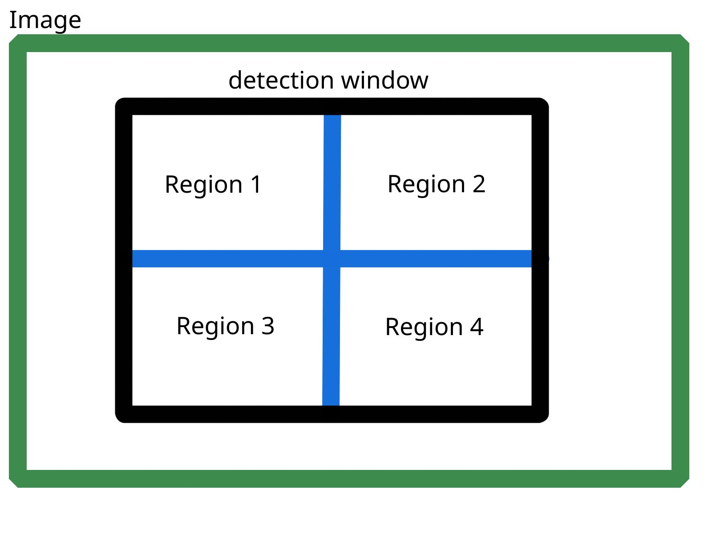

We are building a face counter with opencv. 
Therefore we ingest the webcam feed with opencv annotate frame by frame with bounding boxes and display the live feed after detection in it's various stages.

To detect the face and later the eyes we use haar-like feature which was first proposed by Paul Viola and Michael Jones in there publication "Rapid Object Detection using a Boosted Cascade of Simple Features" in 2001.

The procedure works with a detection window, and compares adjacent regions in it by summing up the pixel intensity in each region and calculating there differences.



An image is represented by it's corresponding red green blue values for each pixel. For example a 4x4 pixel image could look in our code like `[[[1,1],[1,1]], [[10,10],[10,10]], [[100,100],[100,100]]]`. Where the first block of ones are the corresponding red the block of tens are green and the last block of hundrets are blue values of the pixels.

So we can calculate numerically the intensity of each region and calculating the difference of region 1 and region 2, region 1 and region 3, and so on. The so gathered features are now compared to already learnd ones by the model. A common Haar feature for face detection is for example a set of two adjacent rectangles that lie above the eye and the cheek region. To compare the extracted features a convolution in the predefined size is done on the image. That means that the haar-like filter is moved over the image and a region that yield the same results, when it's intensity difference is calculated, is looked for.

To confidently detect an object many of these haar-like features must match to be shure a given object is detected.

Sufficent theory for now lets take a look on how to apply them.

Her we are loading the haar detection models


```python
#models can be downloaded from https://github.com/opencv/opencv/tree/master/data/haarcascades
face_detector = CascadeClassifier('model/haarcascade_frontalface_default.xml')
eye_detector = CascadeClassifier('model/haarcascade_eye_tree_eyeglasses.xml')
```

Next we declare the function which detects and annotates the faces, and displays the statistics.


```python
def add_statistics_to_frame(frame, stats):
    return cv2.putText(
        frame, # image to put the text on
        str(stats), # text to display
        (0,50), #font position
        cv2.FONT_HERSHEY_SIMPLEX,  #fonttype
        1, # fontsize
        (255,255,255), # fontcolor
        2 #linewith
    )
```


```python
def viz_stats_and_boundingboxes(gray, frame):
    faces = face_detector.detectMultiScale(gray, 1.3, 5) # detect faces in gray img
    frame_ = frame.copy() #make a working copy of the frame for annotation
    for (x,y,w,h) in faces: 
        cv2.rectangle(frame_,(x,y),(x+w,y+h),(255,0,0),2) # place boundingbox for face
        
        #crop to face
        roi_gray = gray[y:y+h, x:x+w]
        roi_color = frame_[y:y+h, x:x+w]
        print(roi_color)
        
        #detect eyes in croped face
        eyes = eye_detector.detectMultiScale(roi_gray)
        for (ex,ey,ew,eh) in eyes:
            cv2.rectangle(roi_color,(ex,ey),(ex+ew,ey+eh),(0,255,0),2) #place boundingbox for eyes
    return add_statistics_to_frame(frame_, {'Number of faces detected': len(faces)})
```


```python
#open webcam 
webcam = cv2.VideoCapture(0)
while True:
    # read frame from webcam
    _, frame = webcam.read()
    #convert frame to gray for better detection
    gray = cv2.cvtColor(frame, cv2.COLOR_BGR2GRAY)
    # show the different results
    cv2.imshow('Webcam_gray',gray)
    cv2.imshow('Anotated Webcam', viz_stats_and_boundingboxes(gray,frame))
    cv2.imshow('Webcam', frame)
    if cv2.waitKey(60) >= 0: break
#clean up
cv2.destroyAllWindows()
webcam.release()
```

Thats it for today.
